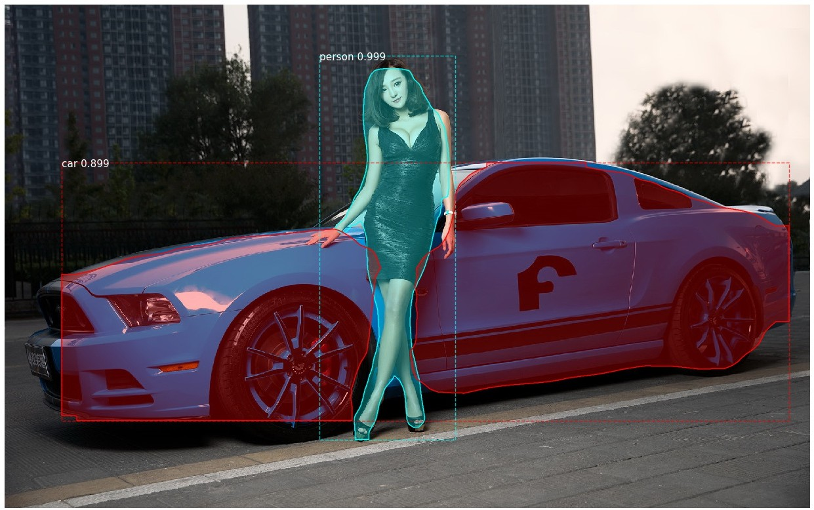

# MaskRCNN

**Mask R-CNN is for  "instance segmentation".** Please reference  https://arxiv.org/abs/1703.06870.

**Example 1**

**Example2** 

## Demo

`python predict.py image/car58a54312d.jpg`

## Training
1. `Put Coco files under data directory.`

   `data/`
   `├── annotations`
   `├── test2014`
   `├── train2014`
   `└── val2014`

2. `./train.sh`

## Requirements
* Python 3.6
* Pytorch 0.4.0
* matplotlib, scipy, skimage

## Installation
1. Clone this repository.

        git clone https://github.com/delldu/MaskRCNN.git

2. We use functions from two more repositories that need to be build with the right `--arch` option for cuda. The two functions are Non-Maximum Suppression from ruotianluo's [pytorch-faster-rcnn](https://github.com/ruotianluo/pytorch-faster-rcnn)
       repository and longcw's [RoiAlign](https://github.com/longcw/RoIAlign.pytorch).

| GPU | arch |
| --- | --- |
| TitanX | sm_52 |
| GTX 960M | sm_50 |
| GTX 1070 | sm_61 |
| GTX 1080 (Ti) | sm_61 |

       cd nms/src/cuda/
       nvcc -c -o nms_kernel.cu.o nms_kernel.cu -x cu -Xcompiler -fPIC -arch=[arch]
       cd ../../
       python build.py
       cd ../
       
       cd roialign/roi_align/src/cuda/
       nvcc -c -o crop_and_resize_kernel.cu.o crop_and_resize_kernel.cu -x cu -Xcompiler -fPIC -arch=[arch]
       cd ../../
       python build.py
       cd ../../
       
       cd cocoapi/PythonAPI
       python setup.py install
       cd ../..

## Thanks

1. Mask R-CNN https://arxiv.org/abs/1703.06870

2. https://github.com/multimodallearning/pytorch-mask-rcnn

